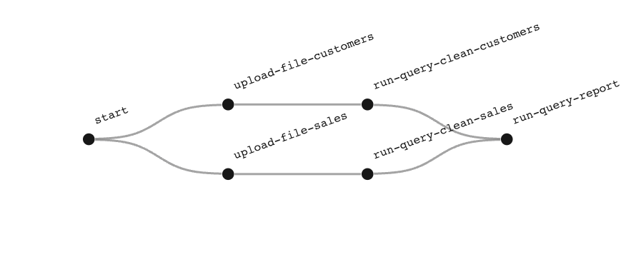

# Houston Quickstart - Google Cloud Platform

In this quickstart you will create a 100% serverless data pipeline on Google Cloud Platform using Python. You will need 
access to a GCP project and [gcloud](https://cloud.google.com/sdk/install) installed.

This example uses Google Cloud Functions to execute each stage in the pipeline. The implementation would be the same for 
container based stages, just with different methods of triggering the stage.

Google Cloud Functions can be triggered with Google Cloud Pub/Sub, as well as with HTTP requests. This example uses 
Pub/Sub as this allows us to easily trigger functions in parallel, and guarantees our functions will execute by 
re-sending unacknowledged messages. To use an HTTP trigger, follow the additional steps after the end of the quickstart.

## Setup

1. Create an account on [callhouston.io](http://callhouston.io)

2. Activate the free subscription: Go to [_Account > Subscription_](https://callhouston.io/account/subscription) and 
select the **_Free_** plan

3. Create your API key: Go to [_Account > Key_](https://callhouston.io/account/key) and click **_Create_** 

4. Install the Python client:
   ```bash
   pip install houston-client
   ```

5. Clone the quickstart repository:
   ```bash
   git clone git@github.com:datasparq-intelligent-products/houston-quickstart-python.git
   cd houston-quickstart-python
   ```

6. Change your working directory to the google-cloud directory inside this repo:
   ```bash
   cd google-cloud
   ```

## Create a Plan

We need to create a plan that Houston can follow to sting together each stage of this pipeline. Plans are defined in 
_JSON_ and have the following structure: 

```json
{
  "name": "houston-quickstart",
  "stages": [
    {
      "name": "upload-file-customers",
      "downstream": "run-query-clean-customers"
    },
    {
      "name": "run-query-clean-customers"
    },
    ...
  ]
}
```

We want to define the following plan, comprised of 7 stages:




We also need to add parameters to each stage so that the Python function running each one knows what to do. Houston's 
Python client expects the plan as a dictionary so we can define it in Python and make some parameters dynamic:

```python
plan = {
  "name": "houston-quickstart",
  "stages": [
    {
      "name": "upload-file-customers",
      "downstream": "run-query-clean-customers",
      "params": {
        "psq": ps_topic,
        "file_location": f"./data-bucket-{ENV}/customers_raw.csv"
      }
    },
    {
      "name": "run-query-clean-customers",
      "params": {
        "psq": ps_topic,
        "query_name": "clean_customers.sql"
      }
    },
    ...
  ]
}
```

We also need to add a parameter for each stage that we can use to trigger the function that runs that stage.

A plan has been defined in Python in save_plan.py. We'll use the Houston Python client to save the plan.

1. Set your Houston API key as an environment variable:  
   ```bash
   export API_KEY='<your api key>'
   ```
    
2. Run _save_plan.py_
   ```bash
   python save_plan.py
   ```

3. Go to the [Houston Dashboard](https://callhouston.io/dashboard) and check your plan has appeared. Click on it to 
view the DAG. Click on a stage to view its params. 

## Deploy a Cloud Function

For this example we've simplified things by using a single cloud function to execute each stage in the pipeline. This isn't recommended as
All of the tasks we need to complete in our pipeline can be done with Python, so we'll create a single cloud function 
that will execute a Python function corresponding to the Houston stage it's running.

1. Deploy with the function either from the [Cloud Console](https://console.cloud.google.com/functions), with with gcloud:

   If using the Cloud Console:
     - Set the trigger to Pub/Sub and create a new topic called _'houston-cloud-function-topic'_ 
     - Set the Runtime to Python 3.7 
     - Copy _pusbsub_function/main.py_ into the box for MAIN.PY  
     - Copy _pusbsub_function/requirements.txt_ into the box for REQUIREMENTS.TXT
     - Add an environment variable with NAME = API_KEY and VALUE = _your houston api key_  
     - Click _CREATE_

   If using gcloud, run the following in the command line. (you may want to change the region to one closer to you):

   ```bash
   gcloud functions deploy houston-cloud-function --runtime python37 --trigger-topic houston-cloud-function-topic \
       --source pubsub_function --entry-point main --region europe-west1 --timeout 540 --set-env-vars API_KEY=$API_KEY
   ```

2. Before we can use this function in our pipeline we need to grant it permission to trigger other functions. Grant the Cloud Functions Invoker (roles/cloudfunctions.invoker) role to the calling function identity on the receiving function. By default, this identity is PROJECT_ID@appspot.gserviceaccount.com.

## Start a Mission

1. Start a mission by calling the cloud function with a parameter stage="start". We can either use the 'testing' feature on the Cloud Console, or call the trigger uri directly with bash. If using the Cloud Console, paste the following JSON into the 'triggering event' text area:
   ```json
   {"stage": "start"}
   ```

2. Go to the [Houston Dashboard](https://callhouston.io/dashboard) and check the active (or possibly already finished) 
mission.

Congratulations! You've got a completely serverless pipeline. 

